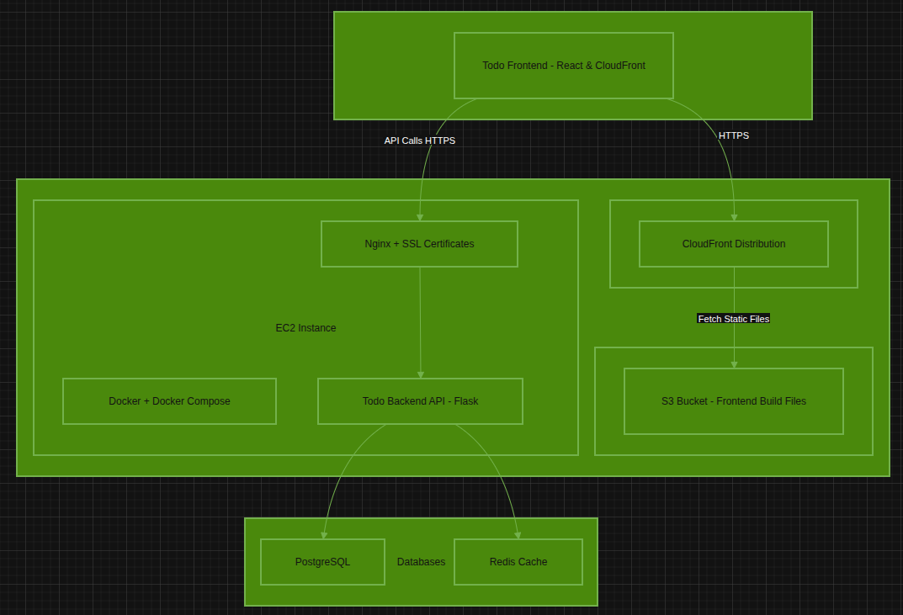
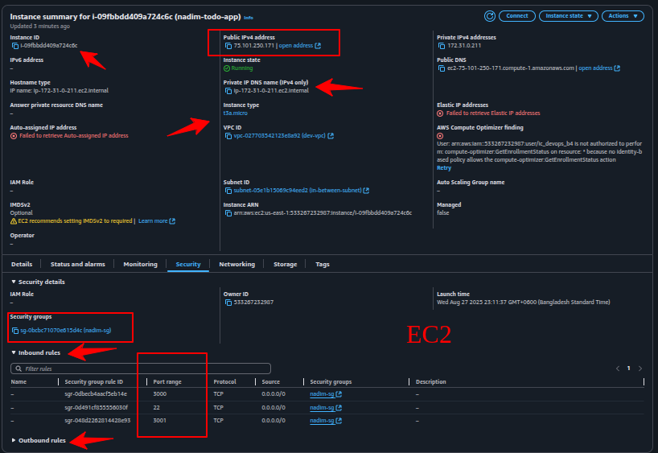
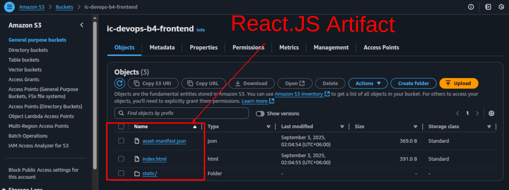
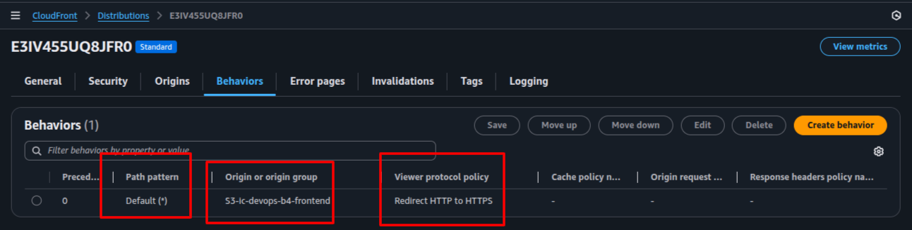
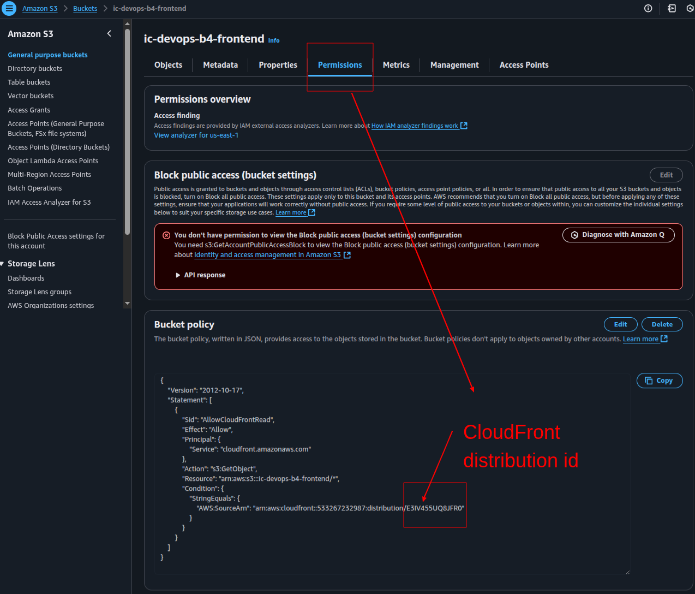
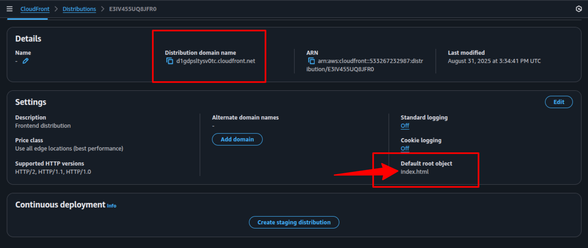

# Todo application in AWS

## See the website

- Permit in your browser (todo-backend) => https://75.101.250.171:3001
- The "Your connection to this site is not secure" warning for https://75.101.250.171:3001/ appears because browsers do not trust the SSL certificate provided by your EC2 instance IP.
- So select `Advanced`
- Select `Proceed to 75.101.250.171 (unsafe)`

- Then search => https://d1gdpsltysv0tc.cloudfront.net/
- In my Todo app, you can create, get, and delete. Please reload after creation/deletion


## Architecture


# TODO-Backend in AWS EC2 deploy

## AWS CLI configure `https://docs.aws.amazon.com/cli/latest/userguide/getting-started-install.html`
```bash
# Check version
aws --version

# For Linux
curl "https://awscli.amazonaws.com/awscli-exe-linux-x86_64.zip" -o "awscliv2.zip"
unzip awscliv2.zip
sudo ./aws/install

# Configure AWS CLI with your credentials
aws configure

- AWS Access Key ID [****************XP5J]: 
- AWS Secret Access Key [****************208+]: 
- Default region name [us-east-1]: 
- Default output format [json]: 

# Location of config and credentials
nano ~/.aws/credentials
```

## EC2 instance with AWS CLI
```bash
# Create the Key Pair
aws ec2 create-key-pair \
  --key-name nadim-ec2-instance-key \
  --query 'KeyMaterial' \
  --output text > nadim-ec2-instance-key.pem

chmod 400 nadim-ec2-instance-key.pem

# Create Security Group
aws ec2 create-security-group \
  --group-name nadim-ec2-group \
  --description "Security group for Nadim's EC2 instance"

# Launch EC2 Instance
aws ec2 run-instances \
    --image-id ami-0c02fb55956c7d316 \
    --instance-type t3a.micro \
    --key-name nadim-ec2-instance-key \
    --security-group-ids sg-0bcbc71070e615d4c \
    --subnet-id subnet-05e1b15069c94eed2 \
    --associate-public-ip-address \
    --tag-specifications 'ResourceType=instance,Tags=[{Key=Name,Value=nadim-todo-app}]'

# Get your Instance ID
aws ec2 describe-instances \
  --query 'Reservations[*].Instances[*].InstanceId' \
  --output text

# Get your Public IP
aws ec2 describe-instances \
  --instance-ids <INSTANCE_ID> \
  --query 'Reservations[*].Instances[*].PublicIpAddress' \
  --output text

# Connect to Instance
ssh -i "nadim-ec2-instance-key.pem" ec2-user@<PUBLIC_IP>

```
## See the Instance


## Environment Setup (Install Git, Docker, Docker Compose) in the Server
```bash
# Update package index
sudo yum update -y

# Enable Docker in amazon-linux-extras
sudo amazon-linux-extras enable docker

# Install Docker
sudo yum install -y docker

# Start Docker service
sudo service docker start

# Add your user to docker group (so you don’t need sudo)
sudo usermod -aG docker ec2-user

# install git
sudo yum update -y
sudo yum install -y git
```

## Setup Project
```bash
git clone https://github.com/aa-nadim/todo-frontend.git
cd todo-frontend

# Create SSL certificates
# Create the certificates directory
mkdir -p nginx/certs

# Generate SSL certificates
chmod +x setup-certificates.sh
./setup-certificates.sh
```

## Run the Application
```bash
docker-compose -f docker-compose.aws.yml up -d --build
docker-compose -f docker-compose.aws.yml ps
docker-compose -f docker-compose.aws.yml up -d api

# Test the HTTPS endpoint
curl -k https://x.x.x.x:3001/todos
```

# Configure S3 & CloudFront
```bash
# Create the Bucket
aws s3api create-bucket \
  --bucket nadim-ec2-bucket-2025 \
  --region us-east-1

# In your local PC (not aws)
git clone https://github.com/aa-nadim/todo-frontend.git
cd todo-frontend

# set API URL to the EC2 public IP
export REACT_APP_API_URL="https://75.101.250.171:3001"
npm ci
npm run build

# Upload Files & directories
aws s3 sync build/ s3://nadim-ec2-bucket-2025 --delete


# Create CloudFront distribution with a new S3 origin and settings.
aws cloudfront update-distribution --id E3IV455UQ8JFR0 \
  --distribution-config '{
    "CallerReference": "1756395811",
    "Aliases": {"Quantity": 0},
    "DefaultRootObject": "index.html",
    "Origins": {
      "Quantity": 1,
      "Items": [{
        "Id": "S3-nadim-ec2-bucket-2025",
        "DomainName": "nadim-ec2-bucket-2025.s3.amazonaws.com",
        "OriginPath": "",
        "CustomHeaders": {"Quantity": 0},
        "S3OriginConfig": {
          "OriginAccessIdentity": ""
        },
        "ConnectionAttempts": 3,
        "ConnectionTimeout": 10,
        "OriginShield": {"Enabled": false},
        "OriginAccessControlId": "E1U5SU53APK3RH"
      }]
    },
    "OriginGroups": {"Quantity": 0},
    "DefaultCacheBehavior": {
      "TargetOriginId": "S3-nadim-ec2-bucket-2025",
      "TrustedSigners": {"Enabled": false, "Quantity": 0},
      "TrustedKeyGroups": {"Enabled": false, "Quantity": 0},
      "ViewerProtocolPolicy": "redirect-to-https",
      "AllowedMethods": {
        "Quantity": 2,
        "Items": ["HEAD", "GET"],
        "CachedMethods": {
          "Quantity": 2,
          "Items": ["HEAD", "GET"]
        }
      },
      "SmoothStreaming": false,
      "Compress": false,
      "LambdaFunctionAssociations": {"Quantity": 0},
      "FunctionAssociations": {"Quantity": 0},
      "FieldLevelEncryptionId": "",
      "GrpcConfig": {"Enabled": false},
      "ForwardedValues": {
        "QueryString": false,
        "Cookies": {"Forward": "none"},
        "Headers": {"Quantity": 0},
        "QueryStringCacheKeys": {"Quantity": 0}
      },
      "MinTTL": 0,
      "DefaultTTL": 0,
      "MaxTTL": 0
    },
    "CacheBehaviors": {"Quantity": 0},
    "CustomErrorResponses": {"Quantity": 0},
    "Comment": "Frontend distribution",
    "Logging": {
      "Enabled": false,
      "IncludeCookies": false,
      "Bucket": "",
      "Prefix": ""
    },
    "PriceClass": "PriceClass_All",
    "Enabled": true,
    "ViewerCertificate": {
      "CloudFrontDefaultCertificate": true,
      "MinimumProtocolVersion": "TLSv1"
    },
    "Restrictions": {
      "GeoRestriction": {
        "RestrictionType": "none",
        "Quantity": 0
      }
    },
    "WebACLId": "",
    "HttpVersion": "http2",
    "IsIPV6Enabled": true,
    "ContinuousDeploymentPolicyId": "",
    "Staging": false
  }' \
  --if-match $(aws cloudfront get-distribution --id E3IV455UQ8JFR0 --query 'ETag' --output text)

# Update S3 Bucket Policy to Allow CloudFront Access
# Get your CloudFront distribution ID
aws cloudfront get-distribution --id <DISTRIBUTION_ID> --query "Distribution.ARN" --output text

# attach a bucket policy
aws s3api put-bucket-policy \
  --bucket nadim-ec2-bucket-2025 \
  --policy '{
    "Version": "2012-10-17",
    "Statement": [{
      "Effect": "Allow",
      "Principal": {"Service": "cloudfront.amazonaws.com"},
      "Action": "s3:GetObject",
      "Resource": "arn:aws:s3:::nadim-ec2-bucket-2025/*",
      "Condition": {
        "StringEquals": {
          "AWS:SourceArn": "arn:aws:cloudfront::<ACCOUNT_ID>:distribution/<DISTRIBUTION_ID>"
        }
      }
    }]
  }'

# Get the CloudFront Domain Name
aws cloudfront list-distributions --query "DistributionList.Items[].DomainName" --output text

```

## See S3 Bucket



## See CloudFront



## Add Cloudfront ID in S3



## See Domain in CloudFront
